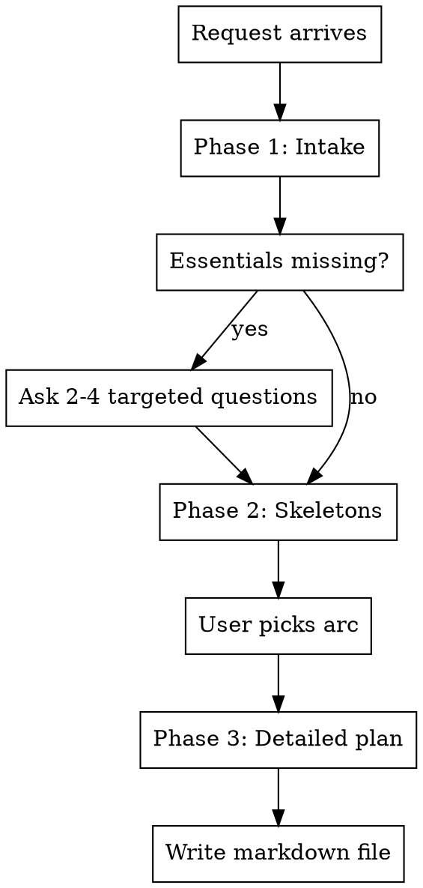

# Facilitation Planning

## Overview

Turn a loosely stated facilitation request into a concrete, runnable plan grounded in the `awesome-facilitation` catalogue digest.

**Violating the letter of the rules is violating the spirit of the rules.**

## Workflow

### Phase 1 — Intake

Before designing, gather:

- Goal and desired output (decision, alignment, ideas, learning, plan)
- Participants: count, roles, dynamics, trust level
- Time budget and hard constraints
- Mode: in-person, online, or hybrid
- Constraints: what cannot be promised, sensitive topics
- Artifacts and what happens after the session
- **Sponsor / decision owner** — who owns the outcome and can commit resources
- **Decision rule** — consult / consent / consensus / leader-decides / vote; select **before** the arc using `Agreement and Certainty`
- **Authority reality** — will this stick, or can it be overridden? If unclear or predetermined, reframe as **input-gathering, not decision-making**, and say so
- **Acceptance criteria** — what "done" looks like; fallback if no agreement emerges
- **Confidentiality / recording** — Chatham House vs attributed; recorded?; who sees the output (carries into artifacts)
- **Facilitator neutrality + who is in the room** — is the requester a participant or neutral facilitator? Is the decision-maker present? Is any key knowledge-holder missing?

If essentials are missing, ask **2-4 targeted questions**. Do not invent participant count, duration, goals, or constraints. A user saying "just give me something" is not permission to skip intake.

### Phase 2 — Skeletons

Offer **2-3 session arcs** from `references/session-patterns.md`. Each arc lists blocks mapped to specific practices from `references/catalogue.md`, with trade-offs and a recommendation. Wait for the user to pick or adjust before Phase 3.

### Phase 3 — Detailed plan

Expand the chosen arc using `references/plan-template.md`. Scale depth to session size.

Phase 3 is not complete until a markdown file exists with the full plan.

**Path** (first match wins):

1. User-specified path
2. Existing project convention for facilitation or workshop plans (if evident)
3. Default: `docs/facilitation-plans/<YYYY-MM-DD>-<slug>.md` — `<slug>` is kebab-case from session type or goal (e.g. `team-retro`, `q3-priority-alignment`); create the directory if missing

**In chat:** file path plus a brief overview (goal, duration, key blocks). Do not duplicate per-block detail, timed flows, or ASCII frames.

**Follow-up:** when the user refines the plan after Phase 3, edit the same markdown file in place. Do not leave the file stale or create a duplicate unless the user asks.

## Catalogue rule (`framing_plus_labeled`)

Named branded practices are **catalogue-first, always** — select from `references/catalogue.md` with source link.

Framing/admin/transition/break/decision-rule/cut-list blocks may be described as **plain facilitation structure** with no forced catalogue citation.

Off-catalogue is allowed only when the user names it or nothing in the catalogue fits, and must be explicitly labeled: `not from the digest — [real source], unverified against catalogue`. Never fabricate a source; never attribute an off-catalogue method to the digest.

## Output contract

Phase 3 deliverable is a markdown **file** at the resolved path. Chat is a pointer and summary, not the source of truth.

A complete plan includes all REQUIRED sections from `plan-template.md`:

1. Goal and outcomes (incl. decision authority and acceptance criteria when relevant)
2. Agenda table (Time / Block / Format / Output)
3. Per-block detail (why, format+link, frame, facilitator notes, timed flow, output)
4. **Cut list** (if running long, cut X / protect Y)
5. Preparation
6. Hybrid/online parity (when remote participants exist)
7. **Session artifacts** (incl. confidentiality/recording from intake)
8. **Post-session process** (owners, actions, timeline, next checkpoint)

Do not deliver agenda and blocks alone.

## Scaling

| Time | Shape |
| --- | --- |
| ≤30 min | 2-4 blocks, compact detail |
| 45-90 min | 4-6 blocks, ASCII on main blocks |
| 2-4 hours | 6-10 blocks, full preparation |
| 1-2 days | Day arcs, co-facilitation, mandatory hybrid section |

Group size (headcount) is independent of time — see headcount axis in `references/session-patterns.md`. Do not schedule plenary round-robins above ~8 people.

## Hybrid, language, red flags

Hybrid/online: digital board as source of truth, equal remote contribution, online advocate, no room-only workflows.

Language: plan in the user's request language; practice names and links stay English.

Stop if:

- No clear decision authority, or predetermined outcome disguised as participation
- Requester is not neutral (facilitating their own grievance)
- Active interpersonal / HR / legal conflict framed as a workshop
- Key decision-maker or knowledge-holder missing
- Impossible scope for the time
- Safety check fails in the room
- Trauma/grief context routed to an action-oriented arc
- No intake on sparse request; hybrid without online design; no artifacts/post-process; wrong output language

## References

- `references/catalogue.md`, `session-patterns.md`, `plan-template.md`
- Regenerate catalogue: `node scripts/build-catalogue.mjs`

## Testing

Before editing this skill:

1. **Pressure scenarios** — RED/GREEN per `pressure-scenarios.md`; record in `pressure-results-<date>.md`.
2. **E2E briefs** — per `e2e/briefs.md`: executor subagent per brief, separate facilitator review subagent per output (`e2e/facilitator-review.md`). Commit run under `e2e/runs/<date>/` with `run-manifest.md` pinning definition file contents, outputs, reviews, and `summary.md`.
3. **Catalogue sync** — `node scripts/build-catalogue.mjs` after `awesome-facilitation` changes.

Non-goals: no live meeting bot, no catalogue curation in this skill, manual sync only.

## Common mistakes

Designing before intake; inventing branded practice names or fake catalogue citations; staging decision sessions without authority; over-scoping short meetings; plenary round-robins at large scale; step times exceeding block duration; hybrid as "room plus video"; skipping follow-up or cut list; ignoring "do not promise" constraints; Phase 3 plan delivered in chat only with no markdown file; follow-up edits only in chat while the file stays stale; new file on every revision instead of updating the existing plan document; editing without pressure + E2E runs committed.
