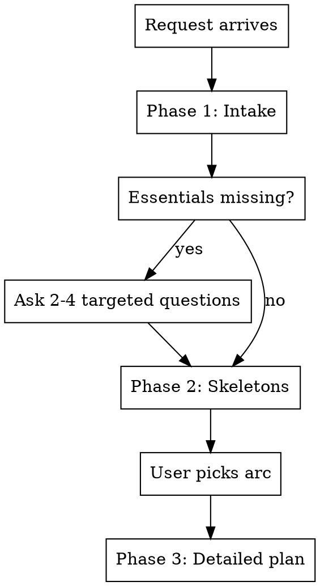

# Facilitation Planning

## Overview

Turn a loosely stated facilitation request into a concrete, runnable plan grounded in the `awesome-facilitation` catalogue digest.

**Violating the letter of the rules is violating the spirit of the rules.**

## Workflow

### Phase 1 — Intake

Before designing, gather:

- Goal and desired output (decision, alignment, ideas, learning, plan)
- Participants: count, roles, dynamics, trust level
- Time budget and hard constraints
- Mode: in-person, online, or hybrid
- Constraints: what cannot be promised, sensitive topics
- Artifacts and what happens after the session

If essentials are missing, ask **2-4 targeted questions**. Do not invent participant count, duration, goals, or constraints. A user saying "just give me something" is not permission to skip intake.

### Phase 2 — Skeletons

Offer **2-3 session arcs** from `references/session-patterns.md`. Each arc lists blocks mapped to specific practices from `references/catalogue.md`, with trade-offs and a recommendation. Wait for the user to pick or adjust before Phase 3.

### Phase 3 — Detailed plan

Expand the chosen arc using `references/plan-template.md`. Scale depth to session size.

## Catalogue rule

Select formats **only** from `references/catalogue.md`. Every recommended practice must appear there with its source link.

If the user names a practice not in the catalogue (for example Sailboat), say so honestly. Offer the closest catalogue match or a plain generic structure. **Never invent branded practice names** or attribute non-catalogue methods to the digest.

## Output contract

A complete plan includes all REQUIRED sections from `plan-template.md`:

1. Goal and outcomes
2. Agenda table (Time / Block / Format / Output)
3. Per-block detail (why, format+link, frame, facilitator notes, timed flow, output)
4. Preparation
5. Hybrid/online parity (when remote participants exist)
6. **Session artifacts**
7. **Post-session process** (owners, actions, timeline, next checkpoint)

Do not deliver agenda and blocks alone.

## Scaling

| Time | Shape |
| --- | --- |
| ≤30 min | 2-4 blocks, compact detail |
| 45-90 min | 4-6 blocks, ASCII on main blocks |
| 2-4 hours | 6-10 blocks, full preparation |
| 1-2 days | Day arcs, co-facilitation, mandatory hybrid section |

## Hybrid, language, red flags

Hybrid/online: digital board as source of truth, equal remote contribution, online advocate, no room-only workflows.

Language: plan in the user's request language; practice names and links stay English.

Stop if: no intake on sparse request; non-catalogue practice; multi-day plan for ≤30 min; hybrid without online design; no artifacts/post-process; wrong output language.

## References

- `references/catalogue.md`, `session-patterns.md`, `plan-template.md`
- Regenerate catalogue: `node scripts/build-catalogue.mjs`

## Common mistakes

Designing before intake; inventing formats; over-scoping short meetings; hybrid as "room plus video"; skipping follow-up; ignoring "do not promise" constraints.
