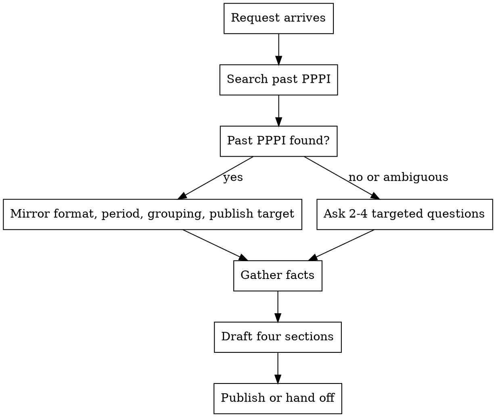

# PPPI Status Report

## Overview

PPPI extends the PPP (Progress, Plans, Problems) status framework with **Ideas** — optional future improvements kept separate from current Plans.

**Core principle:** mirror-or-ask. Discover past PPPI reports (wiki, docs, notes, internal search) and reuse their shape, period, grouping, and publish location. If none exist or the format is ambiguous, ask 2–4 targeted questions. Do not silently default to a project-by-project table.

**Violating the letter of the rules is violating the spirit of the rules.**

## When to Use

- User asks for PPPI, PPP + Ideas, mid-sprint/mid-review status, weekly status, or 1-on-1 prep
- Updating an existing PPPI for a new period
- Converting scattered notes into a structured status report

## When Not to Use

- Full project status reports with budget, traffic-light health, and executive KPIs — use the project's status template instead
- Retrospectives or postmortems — use a retro format
- OKR scoring or quarterly business reviews — use OKR/review tooling

## Workflow



### Step 1 — Discover format (mirror-or-ask)

Search for prior PPPI from the same person, team, or project: wiki pages, markdown files, tracker comments, chat exports, internal search.

**Mirror when found:** section names, order, grouping (flat vs by project/goal/theme), period label, language, publish location.

**Ask when missing or ambiguous (pick 2–4):**

- Reporting period (dates or sprint name)
- Grouping: flat list vs grouped — and by what (project, goal, theme)
- Publish target (wiki page, markdown file, tracker comment, chat only)
- Fact sources (closed tickets, merged PRs, notes, meetings)

A user saying "just draft it" or "standard template is fine" is **not** permission to skip discovery or invent a project table.

### Step 2 — Gather facts

Progress must come from verifiable sources when available: closed tickets, merged PRs, shipped docs, meeting notes. Do not invent accomplishments.

If facts are incomplete, either ask or draft with explicit `[assumption]` / `[needs source]` markers — not silent fiction.

### Step 3 — Draft four sections

Always include all four sections in this order: **Progress → Plans → Problems → Ideas**. Ideas may be empty (`None` / `-`). Use a different order only when mirroring a past PPPI that used it.

Write the PPPI in the **user's or project's language** (not necessarily English).

### Step 4 — Publish

Write to the discovered or requested location. In chat: path/link + brief summary — not the full duplicate unless the user asked for chat-only delivery.

## The Four Sections

| Section | Purpose | Quality bar |
| --- | --- | --- |
| **Progress** | Done in the reporting period | Completed outcomes, not "worked on". 3–7 bullets. Links to proof when available. |
| **Plans** | Priorities for the next period | 3–7 items. Should become next Progress. Not a full task dump. |
| **Problems** | Blockers, risks, stuck items | Name the blocker and who/what is needed. Not self-blame. Empty only if truly none. |
| **Ideas** | Future improvements, optional | Separate from Plans. Backlog of "someday". Empty is fine. |

### Progress — good vs bad

```markdown
# Good
- Shipped L0 validation script and wired it into CI (#142)

# Bad
- Worked on CI validation
- Made progress on the harness
```

### Plans — good vs bad

```markdown
# Good
- Publish @jig-harness/skills to npm after scope is confirmed

# Bad
- Continue working on harness
- Fix bugs
- Meetings
```

### Problems — good vs bad

```markdown
# Good
- npm scope @jig-harness not approved — need manager to confirm org account

# Bad
- Too many things going on
- Ran out of time
```

### Ideas — good vs bad

```markdown
# Good
- Automate skill pressure-test runs in CI (mentioned in workshop)

# Bad
- (merged into Plans) Connect more consumers next week
```

## Format Flexibility

PPPI is **four sections**, not one table shape. Choose format from past PPPI or user answer.

**Flat (default when no past PPPI and no grouping requested):**

```markdown
# PPPI — [period label]

## Progress
- …

## Plans
- …

## Problems
- …

## Ideas
- …
```

**Grouped (only when past PPPI or user requests grouping):**

```markdown
# PPPI — [period label]

## [Group name — project, goal, or theme]

### Progress
- …

### Plans
- …

### Problems
- …

### Ideas
- …

## [Next group]
…
```

Alternative grouped layout (section-first, multiple groups under each) is allowed **only** when mirroring a past PPPI that used it.

Do not introduce project rows/columns unless mirroring or the user explicitly asked for project grouping.

## Rationalization Table

| Excuse | Reality |
| --- | --- |
| "Standard PPPI template means the project table" | Standard means four sections. Table-by-project is one team convention, not universal. |
| "User said hurry — skip questions" | Ask fewer questions or state assumptions explicitly; do not invent structure. |
| "I found a wiki example with a table" | Mirror **this user's** past PPPI, not a random org example. |
| "Ideas = Insights / Notes — same thing" | Keep the label **Ideas** unless past PPPI uses another name. |
| "I'll pull Progress from git/repos" | Repos show activity, not necessarily outcomes. Prefer closed work; mark inference. |
| "Empty Problems looks bad" | Empty is valid. Do not pad with vague stress. |
| "Ideas can go into Plans" | Plans = committed next period. Ideas = optional future. Keep separate. |

## Red Flags — STOP

- Drafting a project × four-column table without past PPPI or explicit user request for project grouping
- Renaming Ideas without mirroring past PPPI
- Inventing period, projects, or accomplishments under time pressure
- Skipping discovery when past PPPI likely exists (wiki, tracker, "update my PPPI")
- Progress bullets with no completed outcome ("worked on", "continued", "in progress")
- Problems that blame the author instead of naming blockers and needed help
- Delivering only in chat when the user expects a wiki/file update
- Reordering sections (e.g. Problems before Plans) without mirroring past PPPI

## Output Contract

A complete PPPI deliverable includes:

1. Period label in the title or header
2. All four sections (Ideas may be empty)
3. Format matching past PPPI or user-confirmed choice
4. Assumptions called out when facts or format were inferred
5. Publish to the requested/discovered location when applicable

## Common Mistakes

- Defaulting to project table from an unrelated org example
- Treating PPPI as a full task log instead of 3–7 priorities per section
- Copying last period's bullets as current Progress
- Merging Ideas into Plans to look productive
- English PPPI when the user and past reports use another language
- Skipping Problems because "everything is fine" while risks exist

## Testing

Before editing this skill, run RED/GREEN scenarios in `pressure-scenarios.md` and record results in `pressure-results-<date>.md`.
